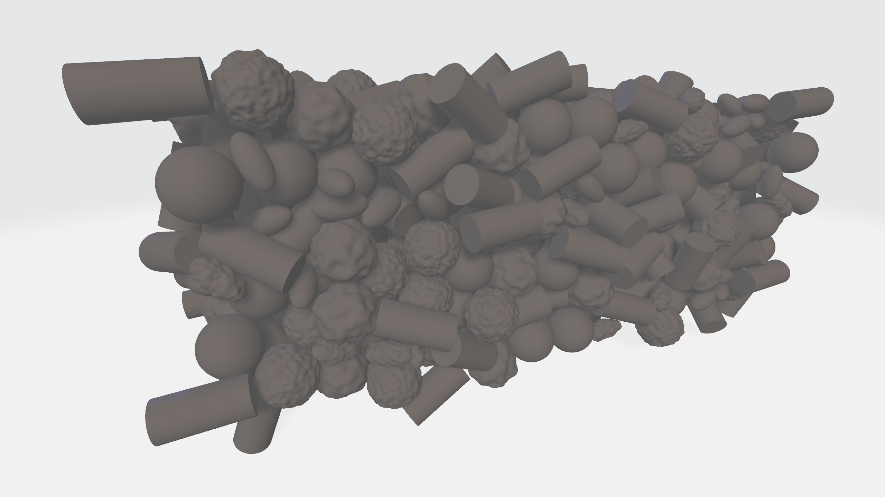

# pygrain3d

A library for 3d particle packing generation with C++ backend and Python interface.



## Installation

### Prerequisites

Make sure you have the following installed:
- Python 3.8+
- CMake 3.15+
- A C++17 compatible compiler (GCC, Clang, MSVC)

### Install from source

Clone the repository with submodules:

```bash
git clone --recursive https://github.com/mariocaballeroyus/pygrain.git
cd pygrain
```

Install the package (automatically builds the C++ extension):

```bash
pip install -e .
```

Now you can import `pygrain` from anywhere!